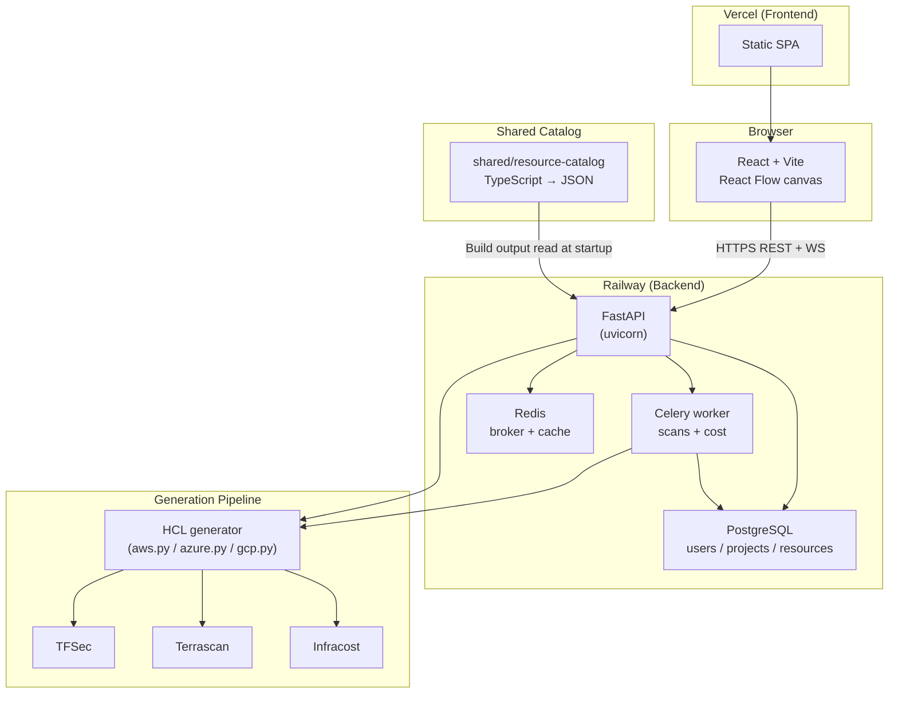

<h1 align="center">CloudForge</h1>

<p align="center">
  <b>Visual Infrastructure-as-Code for Multi-Cloud Teams</b><br/>
  <sub>Design, secure, and cost-estimate AWS / Azure / GCP infrastructure — export production-ready Terraform.</sub>
</p>

<p align="center">
  
  
  
  
  
</p>

<p align="center">
  
  
  
  
  
  
</p>

```
 ██████╗██╗      ██████╗ ██╗   ██╗██████╗ ███████╗ ██████╗ ██████╗  ██████╗ ███████╗
██╔════╝██║     ██╔═══██╗██║   ██║██╔══██╗██╔════╝██╔═══██╗██╔══██╗██╔════╝ ██╔════╝
██║     ██║     ██║   ██║██║   ██║██║  ██║█████╗  ██║   ██║██████╔╝██║  ███╗█████╗
██║     ██║     ██║   ██║██║   ██║██║  ██║██╔══╝  ██║   ██║██╔══██╗██║   ██║██╔══╝
╚██████╗███████╗╚██████╔╝╚██████╔╝██████╔╝██║     ╚██████╔╝██║  ██║╚██████╔╝███████╗
 ╚═════╝╚══════╝ ╚═════╝  ╚═════╝ ╚═════╝ ╚═╝      ╚═════╝ ╚═╝  ╚═╝ ╚═════╝ ╚══════╝
```

---

## Table of Contents

- [Why CloudForge?](#why-cloudforge)
- [Quick Start](#quick-start)
- [Features](#features)
- [Architecture](#architecture)
- [Tech Stack](#tech-stack)
- [Project Structure](#project-structure)
- [Development](#development)
- [Testing](#testing)
- [Deployment](#deployment)
- [API Reference](#api-reference)
- [Roadmap](#roadmap)
- [Contributing](#contributing)
- [Security](#security)
- [License](#license)
- [Acknowledgments](#acknowledgments)

---

## Why CloudForge?

Writing Terraform by hand is slow, error-prone, and closed to anyone who doesn't already know HCL. Pure visual tools (draw.io, Lucidchart) look nice but don't produce anything you can deploy.

**CloudForge bridges that gap.** Drag resources onto a canvas, connect them, and get validated, security-scanned, cost-estimated Terraform out the other side — for AWS, Azure, or GCP, from one UI.

| Problem | CloudForge's answer |
|---|---|
| HCL is a barrier for junior engineers and non-ops stakeholders | Drag-and-drop designer with per-resource forms |
| Security misconfigurations ship to prod | Inline TFSec + Terrascan runs on every generation |
| Costs discovered *after* the invoice | Real-time Infracost estimation in the UI |
| "It worked on AWS" but you need Azure next quarter | Unified catalog generates provider-specific HCL from one diagram |
| Diagrams in Confluence drift from reality | The diagram **is** the source of truth — Terraform is generated from it |

---

## Quick Start

```bash
git clone https://github.com/MohamedGouda99/CloudForge.git
cd CloudForge
cp .env.example .env                # optional: add INFRACOST_API_KEY, ANTHROPIC_API_KEY
./scripts/first-run.sh              # brings up the full stack and waits for health
```

Then open:

- **Frontend** → http://localhost:3000
- **Backend API docs** → http://localhost:8000/docs
- **Default login:** `admin` / `admin123`

> **⚠️ Change the default admin password before exposing beyond localhost.** Rotate it from the Settings page, or set `INITIAL_ADMIN_PASSWORD` in `.env` before the first boot.

**Prerequisites:** Docker 24+, Docker Compose v2. Node.js 18+ and Python 3.11+ are only needed if you work on the code outside Docker.

**Tested platforms:** Windows 11 + WSL2, macOS 14, Ubuntu 22.04.

---

## Features

### Visual Infrastructure Designer
- Drag-and-drop canvas with 100+ AWS / Azure / GCP resources, grouped by service category
- Container resources (VPC, Subnet, ECS Cluster) hold child resources visually — matches Terraform's nesting model
- Smart connection rules with auto-wiring (drop an EC2 into a Subnet → `subnet_id` gets filled in)
- Per-resource forms expose only the fields that matter, validated against the Terraform provider schema

### Multi-Cloud Terraform Generation
- One diagram → Terraform HCL for the provider you choose
- Provider-specific generators under `backend/app/services/terraform/generators/`
- Dependency-ordered output that `terraform plan` accepts on the first try
- Variables extracted automatically so the output is reusable

### Security & Compliance
- **TFSec** — static analysis for cloud misconfigurations
- **Terrascan** — policy-as-code (CIS, SOC2, HIPAA, PCI-DSS rule sets)
- Results rendered inline on the affected resource, not dumped in a log file

### Cost Analytics
- **Infracost** integration runs asynchronously via Celery so the UI stays responsive
- Per-resource monthly/hourly breakdown + aggregated dashboard across projects
- Currency-aware; shows cost *before* you apply

### AI Assistant *(optional)*
- Natural-language resource placement ("add a public load-balancer fronting my ECS service")
- Powered by Anthropic Claude; enable by setting `ANTHROPIC_API_KEY`

### Real-Time Collaboration
- Socket.IO rooms for multi-user editing of the same canvas
- Presence cursors + diagram patches broadcast to the project room

---

## Architecture



**Flow:** a user's diagram is stored as JSON in `projects.diagram_data`. `POST /api/terraform/generate/{id}` hands that JSON to a provider-specific generator, which walks the dependency graph and emits HCL. Security scans and cost estimation run as Celery tasks against the generated HCL; results are written back to `projects.tf_config` and `cost_estimates`.

More detail in [`docs/CLOUDFORGE_ARCHITECTURE_SCHEMA.md`](./docs/CLOUDFORGE_ARCHITECTURE_SCHEMA.md) and [`CLAUDE.md`](./CLAUDE.md).

---

## Tech Stack

| Layer | Choice | Why |
|---|---|---|
| API | FastAPI + uvicorn | Async, auto OpenAPI, Pydantic v2 validation |
| ORM | SQLAlchemy 2.0 + Alembic | Stable, mature, migrations first-class |
| DB | PostgreSQL 15 | JSONB for `diagram_data`, wide provider support |
| Cache / broker | Redis 7 | Celery broker + session + rate-limit store |
| Workers | Celery | Long scans + cost estimation off the request path |
| Frontend | React 18 + TypeScript 5.6 + Vite 6 | Fast HMR, strict types |
| State | Zustand | No Redux boilerplate, good DX for React Flow state |
| Canvas | React Flow | Best-in-class DAG editor |
| Styling | Tailwind 3.4 | Consistent design tokens, no runtime cost |
| Auth | JWT (HS256) + bcrypt | Simple, stateless, no external IdP required |
| IaC tooling | Terraform 1.6, TFSec, Terrascan, Infracost | Industry standard, all CLI-invoked from the backend |
| Dev emulation | LocalStack Pro | AWS APIs locally for the "apply" path |

---

## Project Structure

```
CloudForge/
├── backend/                         FastAPI service + Terraform generators
│   ├── app/
│   │   ├── api/endpoints/           auth, projects, terraform, catalog, ...
│   │   ├── core/                    config, database, security, celery
│   │   ├── models/                  SQLAlchemy ORM
│   │   ├── schemas/                 Pydantic request/response
│   │   └── services/terraform/      factory + per-provider generators
│   ├── src/terraform/               TypeScript HCL helper (called as subprocess)
│   ├── alembic/                     DB migrations
│   └── tests/                       unit / integration / contract / load
│
├── frontend/                        React + Vite SPA
│   ├── src/features/                dashboard, designer, analytics, ...
│   ├── src/components/              reusable UI
│   └── src/lib/                     api client, stores, resource catalog client
│
├── shared/resource-catalog/         TypeScript source of truth for resources
│   └── src/{aws,azure,gcp}/         per-provider resource definitions
│
├── Cloud_Services/                  AWS/Azure/GCP service icons (mounted read-only)
├── specs/                           speckit specs (branch name ↔ folder)
├── scripts/                         test runners + first-run bootstrap
├── docs/                            architecture, ERD, examples
└── docker-compose.yaml              full local stack
```

---

## Development

Full command reference: [`CLAUDE.md`](./CLAUDE.md).

### Run the stack

```bash
docker compose up -d                 # full stack (postgres, redis, backend, celery, frontend, localstack)
docker compose logs -f backend       # tail backend logs
docker compose restart backend       # after backend code changes
```

### Work on the backend

```bash
cd backend
pytest tests/unit -v                 # unit tests
pytest -m "not slow" -v              # skip slow
alembic upgrade head                 # apply DB migrations
black app/ && flake8 app/            # format + lint
```

### Work on the frontend

```bash
cd frontend
npm run dev                          # Vite dev server w/ HMR
npm run build                        # production build (tsc first — fails on type errors)
npm run lint                         # ESLint (--max-warnings 0)
npm run test                         # Vitest
```

### Add a new cloud resource

The [`shared/resource-catalog/`](./shared/resource-catalog/) package is the single source of truth. Steps:

1. Create `shared/resource-catalog/src/<provider>/<category>/<resource>.ts`
2. Export it from the category + provider `index.ts`
3. `cd shared/resource-catalog && npm run build`
4. `docker compose restart backend`

The backend auto-discovers the new resource via `schema_loader.py`; no backend code change needed.

---

## Testing

| Layer | Command | Tool |
|---|---|---|
| Everything | `./scripts/test-all.sh` | orchestrator |
| Backend unit | `./scripts/test-backend.sh --unit` | pytest |
| Frontend unit | `./scripts/test-frontend.sh` | Vitest |
| E2E | `./scripts/test-e2e.sh` | Playwright |
| Accessibility | `./scripts/test-a11y.sh` | pa11y-ci |
| Load | `./scripts/load-test.sh` | Locust |
| Security | `./scripts/security-scan.sh` | pip-audit + npm audit + TFSec |

**Coverage gate: 80% minimum on both backend and frontend.** Full guide in [`TESTING.md`](./TESTING.md).

---

## Deployment

CloudForge is designed to run on a split deployment:

- **Frontend** → [Vercel](https://vercel.com/) (Vite SPA, per-PR preview URLs)
- **Backend + Postgres + Redis + Celery worker** → [Railway](https://railway.com/) (runs the existing `backend/Dockerfile`)

The frontend reads `VITE_API_URL` at build time, so swapping backends is one env-var change.

Self-host alternatives: any Docker-capable host works since the repo ships a production-ready `docker-compose.yaml`. For one-box deploys, Render, Fly.io, and DigitalOcean App Platform also run the stack as-is.

---

## API Reference

Interactive OpenAPI docs at `http://localhost:8000/docs` (disabled in production).

| Group | Endpoint | Purpose |
|---|---|---|
| Auth | `POST /api/auth/login` | Form-encoded login → JWT |
| Auth | `POST /api/auth/register` | Create user |
| Projects | `GET/POST/PUT/DELETE /api/projects/` | CRUD |
| Catalog | `GET /api/catalog/?provider=aws` | Resource definitions |
| Catalog | `GET /api/catalog/{terraform_resource}` | Single resource schema |
| Terraform | `POST /api/terraform/generate/{id}` | Diagram → HCL |
| Terraform | `POST /api/terraform/validate/{id}` | `terraform validate` |
| Terraform | `POST /api/terraform/plan/{id}` | `terraform plan` |
| Security | `POST /api/terraform/tfsec/{id}` | TFSec scan |
| Security | `POST /api/terraform/terrascan/{id}` | Policy scan |
| Cost | `POST /api/terraform/infracost/{id}` | Cost estimate (async) |
| Dashboard | `GET /api/dashboard/stats` | Aggregates for the homepage |
| Assistant | `POST /api/assistant/chat` | Claude-powered design suggestions |
| Health | `GET /api/health` | Liveness + dependency check |

---

## Roadmap

- [ ] GitOps: open a PR with generated Terraform into a target repo
- [ ] Drift detection: compare deployed state to the stored diagram
- [ ] Import existing Terraform back into a visual diagram
- [ ] Compliance report bundles (SOC2, HIPAA, PCI-DSS PDF exports)
- [ ] Team spaces + role-based access
- [ ] Reusable module library (your own Terraform modules shown as catalog entries)

Open an [issue](https://github.com/MohamedGouda99/CloudForge/issues) with the `feature` template to suggest more.

---

## Contributing

Contributions are welcome — feature work, new cloud resources, bug fixes, docs. Start with [`CONTRIBUTING.md`](./CONTRIBUTING.md) for setup, branch conventions, and the PR checklist.

For non-trivial changes, CloudForge uses [speckit](https://github.com/github/spec-kit) — feature branches follow `NNN-<kebab-name>` and map 1:1 to folders under `specs/`. Read the spec/plan/tasks there before touching code.

---

## Security

Found a vulnerability? **Please don't open a public issue.** See [`SECURITY.md`](./SECURITY.md) for the private-disclosure process (GitHub security advisory).

---

## License

[MIT](./LICENSE) © 2026 Mohamed Gouda

You're free to use, modify, distribute, and sublicense this software, subject to the conditions in the LICENSE file.

---

## Acknowledgments

- [Terraform](https://www.terraform.io/) — HCL, providers, the whole ecosystem
- [Aqua Security TFSec](https://github.com/aquasecurity/tfsec) & [Tenable Terrascan](https://github.com/tenable/terrascan) — security scanning
- [Infracost](https://www.infracost.io/) — cost estimation API
- [LocalStack](https://www.localstack.cloud/) — AWS emulation for local dev
- [React Flow](https://reactflow.dev/) — the canvas that makes the designer possible
- [FastAPI](https://fastapi.tiangolo.com/) — the backend framework

---

<p align="center">
  <sub>Built with care. Star the repo if it helps you ship infra faster.</sub>
</p>
