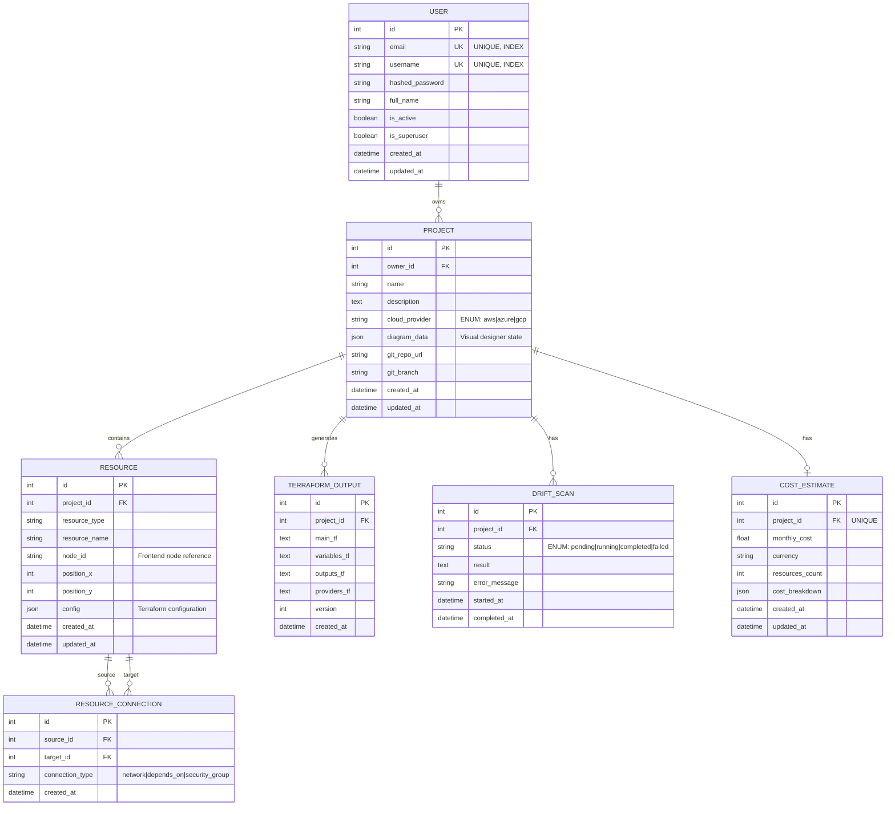
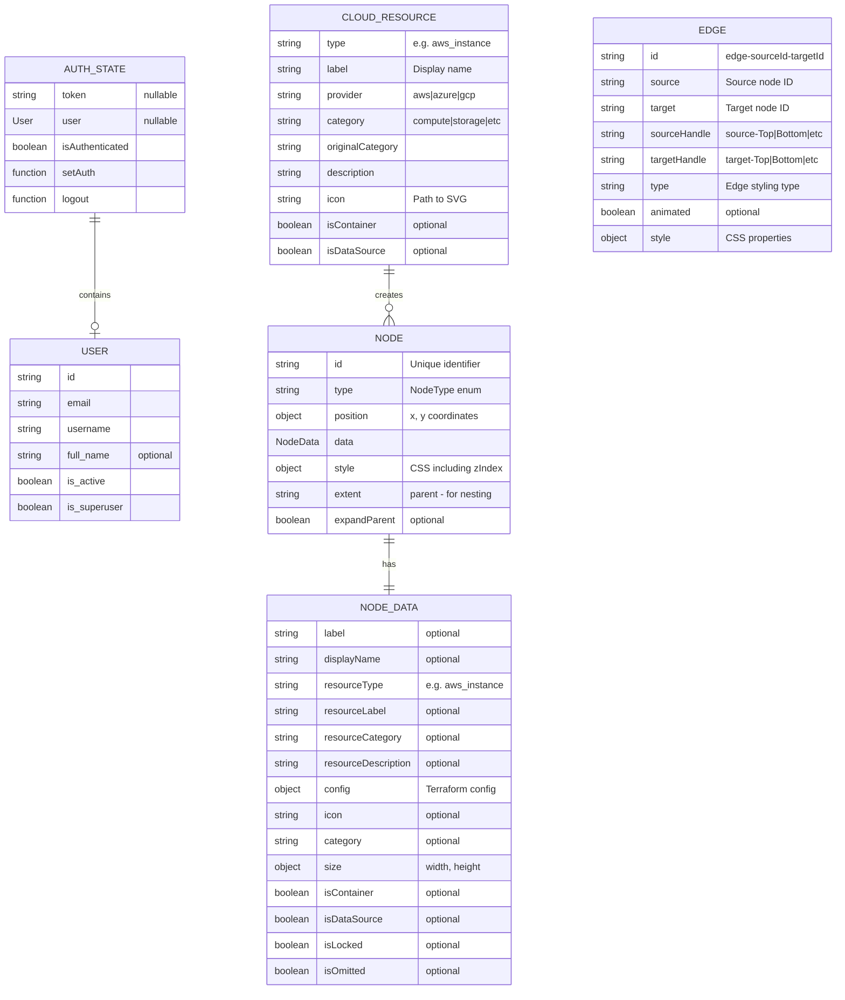
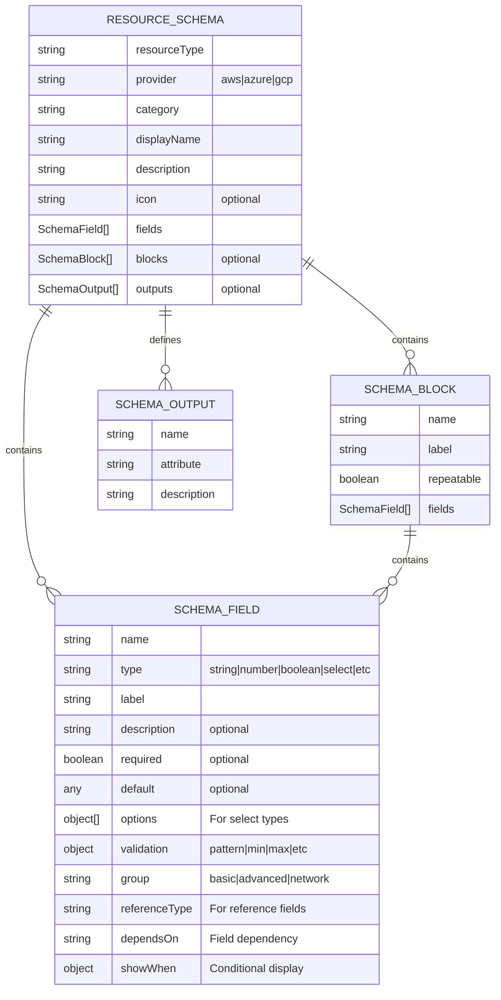
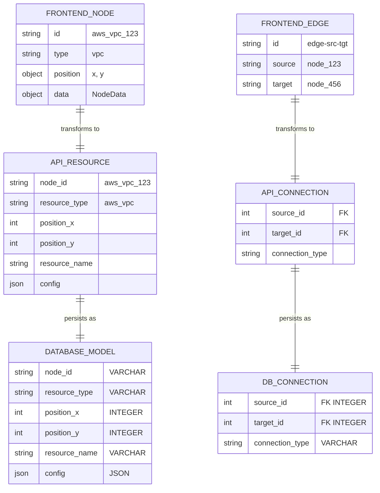
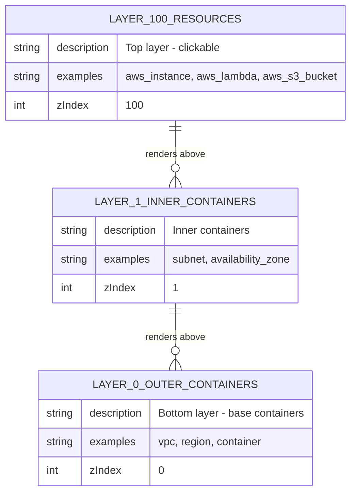

# Entity Relationship Diagrams

This document is the authoritative visual reference for CloudForge's data layer. Diagrams below are authored in [Mermaid](https://mermaid.js.org/) and render natively on GitHub. They're kept in sync with `backend/app/models/` — when a model changes, update the matching diagram in the same PR.

## Contents

- [Backend Database (SQLAlchemy)](#backend-database-erd-sqlalchemy-models)
- [Relationship Matrix](#relationship-matrix)
- [Key Design Decisions](#key-design-decisions)

---

## Backend Database ERD (SQLAlchemy Models)

---

## Frontend Data Model ERD (TypeScript Interfaces)

---

## Resource Schema Types

---

## API Data Flow

---

## Z-Index Layer System

---

## AWS Resource Catalog Structure

```mermaid
erDiagram
    AWS_CATALOG {
        string provider "aws"
        CloudResource[] resources
    }

    COMPUTE_CATALOG {
        string category "compute"
        string[] types "aws_instance, aws_launch_template, aws_autoscaling_group"
    }

    STORAGE_CATALOG {
        string category "storage"
        string[] types "aws_s3_bucket, aws_efs_file_system, aws_ebs_volume"
    }

    DATABASE_CATALOG {
        string category "database"
        string[] types "aws_db_instance, aws_rds_cluster, aws_dynamodb_table"
    }

    NETWORKING_CATALOG {
        string category "networking"
        string[] types "aws_vpc, aws_subnet, aws_internet_gateway, aws_nat_gateway"
    }

    SECURITY_CATALOG {
        string category "security"
        string[] types "aws_security_group, aws_iam_role, aws_kms_key"
    }

    SERVERLESS_CATALOG {
        string category "serverless"
        string[] types "aws_lambda_function, aws_api_gateway_rest_api"
    }

    CONTAINERS_CATALOG {
        string category "containers"
        string[] types "aws_ecs_cluster, aws_eks_cluster, aws_ecr_repository"
    }

    MESSAGING_CATALOG {
        string category "messaging"
        string[] types "aws_sns_topic, aws_sqs_queue"
    }

    AWS_CATALOG ||--|| COMPUTE_CATALOG : "includes"
    AWS_CATALOG ||--|| STORAGE_CATALOG : "includes"
    AWS_CATALOG ||--|| DATABASE_CATALOG : "includes"
    AWS_CATALOG ||--|| NETWORKING_CATALOG : "includes"
    AWS_CATALOG ||--|| SECURITY_CATALOG : "includes"
    AWS_CATALOG ||--|| SERVERLESS_CATALOG : "includes"
    AWS_CATALOG ||--|| CONTAINERS_CATALOG : "includes"
    AWS_CATALOG ||--|| MESSAGING_CATALOG : "includes"
```

---

## Relationships Summary

| Relationship | Type | Description |
|-------------|------|-------------|
| User → Project | 1:N | One user owns many projects |
| Project → Resource | 1:N | One project contains many resources |
| Project → TerraformOutput | 1:N | One project has version history |
| Project → DriftScan | 1:N | One project has scan history |
| Project → CostEstimate | 1:1 | One project has one cost estimate |
| Resource → ResourceConnection | 1:N | One resource has many outgoing connections |
| ResourceConnection → Resource | N:1 | Many connections point to one target |

---

## Key Design Decisions

1. **JSON Storage for Flexibility**
   - `diagram_data` in Project stores entire ReactFlow state
   - `config` in Resource stores Terraform configuration
   - `cost_breakdown` stores full Infracost output

2. **Soft References**
   - Frontend uses string IDs (`node_id`)
   - Backend converts to integer foreign keys
   - Enables canvas state persistence

3. **Layered Z-Index System**
   - Containers: z-index 0-1
   - Resources: z-index 100
   - Ensures click-through behavior

4. **Category-Based Organization**
   - 12 AWS categories
   - Separate catalog files per category
   - Icon mapping per service type
